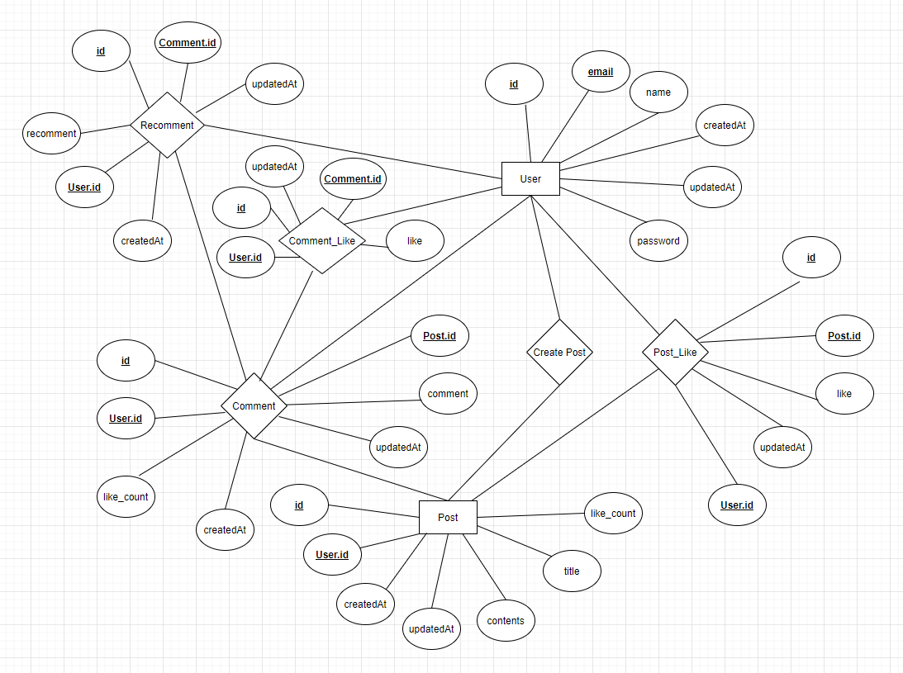
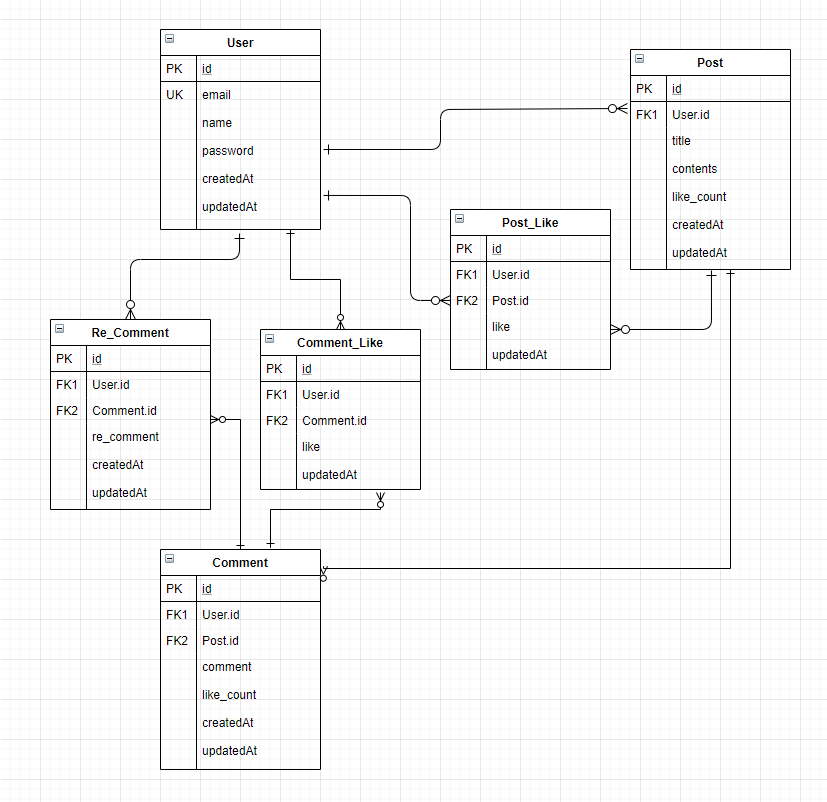
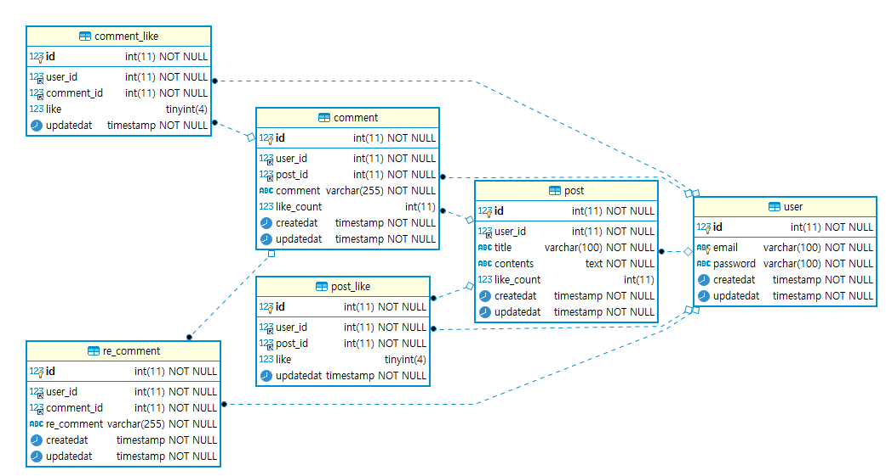

# Board

## 기술 선택

- [ ] Javascript
- [x] Typescript
- [ ] node
- [x] deno
- [ ] react

## 데이터베이스 설계

1. **논리적 모델링**

    <center>
    </img><br>
    </img>
    </center>

2. **물리적 모델링**

    <center></center>

3. **구축**

    ```sql
    CREATE TABLE `user` (
        `id` int(11) NOT NULL AUTO_INCREMENT COMMENT '유저 기본키',
        `email` varchar(100) NOT NULL COMMENT '유저 이메일',
        `password` varchar(100) NOT NULL COMMENT '유저 비밀번호',
        `createdat` timestamp NOT NULL DEFAULT current_timestamp() COMMENT '가입 일자',
        `updatedat` timestamp NOT NULL DEFAULT current_timestamp() ON UPDATE current_timestamp() COMMENT '수정 일자',
        PRIMARY KEY (`id`),
        UNIQUE KEY `user_un` (`email`)
    )
    ```

    ```sql
    CREATE TABLE `post` (
        `id` int(11) NOT NULL AUTO_INCREMENT COMMENT '게시글 기본 키',
        `user_id` int(11) NOT NULL COMMENT '유저 기본 키',
        `title` varchar(100) NOT NULL COMMENT '게시글 제목',
        `contents` text NOT NULL COMMENT '게시글 내용',
        `like_count` int(11) DEFAULT 0 COMMENT '게시글 좋아요 수',
        `createdat` timestamp NOT NULL DEFAULT current_timestamp(),
        `updatedat` timestamp NOT NULL DEFAULT current_timestamp() ON UPDATE current_timestamp(),
        PRIMARY KEY (`id`),
        KEY `post_fk` (`user_id`),
        CONSTRAINT `post_fk` FOREIGN KEY (`user_id`) REFERENCES `user` (`id`)
    )
    ```

    ```sql
    CREATE TABLE `post_like` (
        `id` int(11) NOT NULL AUTO_INCREMENT COMMENT '게시글 좋아요 기본키',
        `user_id` int(11) NOT NULL COMMENT '유저 기본 키',
        `post_id` int(11) NOT NULL COMMENT '게시글 기본 키',
        `like` tinyint(4) DEFAULT 0 COMMENT '좋아요 토글',
        `updatedat` timestamp NOT NULL DEFAULT current_timestamp() ON UPDATE current_timestamp(),
        PRIMARY KEY (`id`),
        KEY `post_like_fk1` (`user_id`),
        KEY `post_like_fk2` (`post_id`),
        CONSTRAINT `post_fk1` FOREIGN KEY (`user_id`) REFERENCES `user` (`id`),
        CONSTRAINT `post_fk2` FOREIGN KEY (`post_id`) REFERENCES `post` (`id`)
    )
    ```

    ```sql
    CREATE TABLE `comment` (
        `id` int(11) NOT NULL AUTO_INCREMENT COMMENT '댓글 기본 키',
        `user_id` int(11) NOT NULL COMMENT '유저 기본 키',
        `post_id` int(11) NOT NULL COMMENT '게시글 기본 키',
        `comment` varchar(255) NOT NULL COMMENT '댓글',
        `like_count` int(11) DEFAULT 0 COMMENT '댓글 좋아요 수',
        `createdat` timestamp NOT NULL DEFAULT current_timestamp(),
        `updatedat` timestamp NOT NULL DEFAULT current_timestamp() ON UPDATE current_timestamp(),
        PRIMARY KEY (`id`),
        KEY `comment_fk1` (`user_id`),
        KEY `comment_fk2` (`post_id`),
        CONSTRAINT `comment_fk1` FOREIGN KEY (`user_id`) REFERENCES `user` (`id`),
        CONSTRAINT `comment_fk2` FOREIGN KEY (`post_id`) REFERENCES `post` (`id`)
    )
    ```

    ```sql
    CREATE TABLE `comment_like` (
        `id` int(11) NOT NULL AUTO_INCREMENT COMMENT '댓글 좋아요 기본 키',
        `user_id` int(11) NOT NULL COMMENT '유저 기본 키',
        `comment_id` int(11) NOT NULL COMMENT '댓글 기본 키',
        `like` tinyint(4) DEFAULT 0 COMMENT '댓글 좋아요 토글',
        `updatedat` timestamp NOT NULL DEFAULT current_timestamp() ON UPDATE current_timestamp(),
        PRIMARY KEY (`id`),
        KEY `comment_like_fk1` (`user_id`),
        KEY `comment_like_fk2` (`comment_id`),
        CONSTRAINT `comment_like_fk1` FOREIGN KEY (`user_id`) REFERENCES `user` (`id`),
        CONSTRAINT `comment_like_fk2` FOREIGN KEY (`comment_id`) REFERENCES `comment` (`id`)
    )
    ```

    ```sql
    CREATE TABLE re_comment (
        `id` int(11) NOT NULL AUTO_INCREMENT COMMENT '댓글 좋아요 기본 키',
        `user_id` int(11) NOT NULL COMMENT '유저 기본 키',
        `comment_id` int(11) NOT NULL COMMENT '댓글 기본 키',
        `re_comment` varchar(255) not null comment '대댓글',
        `createdat` timestamp not null default current_timestamp(),
        `updatedat` timestamp NOT NULL DEFAULT current_timestamp() ON UPDATE current_timestamp(),
        PRIMARY KEY (`id`),
        KEY `re_comment_fk1` (`user_id`),
        KEY `re_comment_fk2` (`comment_id`),
        CONSTRAINT `re_comment_fk1` FOREIGN KEY (`user_id`) REFERENCES `user` (`id`),
        CONSTRAINT `re_comment_fk2` FOREIGN KEY (`comment_id`) REFERENCES `comment` (`id`)
    )
    ```
